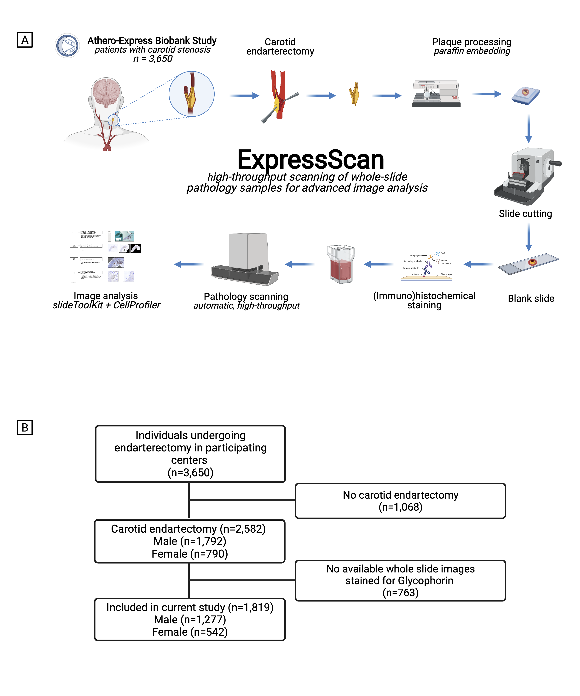

Glycophorin C in carotid atherosclerotic plaque reflects intraplaque hemorrhage and pre-procedural neurological symptoms.
===========================================================

   

### This readme
This readme accompanies the paper "Glycophorin C in carotid atherosclerotic plaque reflects intraplaque hemorrhage and pre-procedural neurological symptoms." by [J.M. Mekke _et al._ **medRxiv** 2021](https://doi.org/10.1101/2021.07.15.21260570). 

--------------

### Abstract.

**Introduction** The accumulation of erythrocyte membranes within an atherosclerotic plaque may contribute to the deposition of free cholesterol and thereby the enlargement of the necrotic core. Erythrocyte membranes can be visualized and quantified in the plaque by immunostaining for the erythrocyte marker glycophorin C. Consequently, we hypothesized, that the accumulation of erythrocytes quantified by glycophorin C is a marker for plaque vulnerability and may therefore reflect intraplaque hemorrhage (IPH), vulnerability of plaques and predict pre-procedural neurological symptoms.

**Methods** We visualized and quantified glycophorin C, defined as the total plaque area that is positive for glycophorin C, in single slides of culprit lesions of human atherosclerotic plaque samples, from 1,819 consecutive asymptomatic and symptomatic patients undergoing carotid endarterectomy from the Athero-Express Biobank with the _slideToolKit_ method. Lipid core, calcifications, collagen content, SMC content and macrophage burden were using a semi-quantitative scoring method, which was dichotomized for as no/minor or moderate/heavy staining according to predefined criteria. IPH was scored as either present or not present. 

**Results** The prevalence of IPH and pre-procedural neurological symptoms were 62.4% and 87.1%, respectively. The amount of glycophorin staining was significantly higher in samples from men compared to samples of women (median 7.15 (IQR:3.37, 13.41) versus median 4.06 (IQR:1.98, 8.32), p<0.001). Glycophorin C was associated with IPH adjusted for clinical confounders(OR 1.90; 95% CI 1.63, 2.21; p=<0.001). Glycophorin C was significantly associated with ipsilateral pre-procedural neurological symptoms (OR:1.27, 95%CI:1.06-1.41, p=0.005).Sex-stratified analysis, showed that this was also the case for  men (OR 1.37; 95%CI 1.12, 1.69; p=0.003), but not for women (OR 1.15; 95%CI 0.77, 1.73; p=0.27). Glycophorin C was associated with classical features of a vulnerable plaque, such as a larger lipid core, a higher macrophage burden, less calcifications, a lower collagen and SMC content. There were marked sex differences, in men, glycophorin C was associated with calcifications and collagen while these associations were not found in women.

**Conclusion** The accumulation of erythrocytes in atherosclerotic plaque quantified and visualized byglycophorin C was independently associated with the presence of IPH, symptomatic preprocedural symptoms in men, and with a more vulnerable plaque composition in both men and women. This strengthens the notion that the accumulation of erythrocytes quantified by glycophorin C can be used as a marker for plaque vulnerability.

{width=50%} 
**Figure: Study design and flowchart of study participants** _A._ Graphical illustration of the study design. Created with [BioRender.com](https://www.biorender.com){target="_blank"}. _B._ Number of individuals included in the current study.

--------------

### Data availability
Data as shared through [DataverseNL](https://doi.org/10.34894/08TUBV).

--------------

### Blog

Earlier we wrote a [blog](https://www.vanderlaanscience.nl/posts/a-story-about-expressscan) about the journey and story behind this project: the **ExpressScan**.

--------------

### WORCS

#### Where do I start?

You can load this project in RStudio by opening the file called 'ExpressScan_Glycophorin.Rproj'.

#### Project structure

<!--  You can add rows to this table, using "|" to separate columns.         -->
File                                    | Description                          | Usage         
--------------------------------------- | ------------------------------------ | --------------
README.md                               | Description of project               | Human editable
ExpressScan_Glycophorin.Rproj                       | Project file                         | Loads project
LICENSE                                 | User permissions                     | Read only
.worcs                                  | WORCS metadata YAML                  | Read only
renv.lock                               | Reproducible R environment           | Read only
images                                  | image directory for project          | Human editable
scripts                                 | Scripts directory                    | Human editable

<!--  You can consider adding the following to this file:                    -->
<!--  * A citation reference for your project                                -->
<!--  * Contact information for questions/comments                           -->
<!--  * How people can offer to contribute to the project                    -->
<!--  * A contributor code of conduct, https://www.contributor-covenant.org/ -->

#### Reproducibility

This project uses the Workflow for Open Reproducible Code in Science (WORCS) to
ensure transparency and reproducibility. The workflow is designed to meet the
principles of Open Science throughout a research project. 

To learn how WORCS helps researchers meet the TOP-guidelines and FAIR principles,
read the preprint at https://osf.io/zcvbs/

#### Advice for authors

* To get started with `worcs`, see the [setup vignette](https://cjvanlissa.github.io/worcs/articles/setup.html)
* For detailed information about the steps of the WORCS workflow, see the [workflow vignette](https://cjvanlissa.github.io/worcs/articles/workflow.html)

#### Advice for readers

Please refer to the vignette on [reproducing a WORCS project]() for step by step advice.
<!-- If your project deviates from the steps outlined in the vignette on     -->
<!-- reproducing a WORCS project, please provide your own advice for         -->
<!-- readers here.                                                           -->

--------------

### Acknowledgements
Dr. Sander W. van der Laan is funded through EU H2020 TO_AITION (grant number: 848146), EU HORIZON NextGen (grant number: 101136962), EU HORIZON MIRACLE (grant number: 101115381), and HealthHolland PPP Allowance ‘Getting the Perfect Image’.

We are thankful for the support of the Netherlands CardioVascular Research Initiative of the Netherlands Heart Foundation (CVON 2011/B019 and CVON 2017-20: Generating the best evidence-based pharmaceutical targets for atherosclerosis [GENIUS I&II]), the ERA-CVD program ‘druggable-MI-targets’ (grant number: 01KL1802), and the Leducq Fondation ‘PlaqOmics’. The research for this contribution was made possible by the AI for Health working group of the EWUU alliance (https://aiforhealth.ewuu.nl/).

Plaque samples are derived from carotid endarterectomies as part of the [Athero-Express Biobank Study](https://pubmed.ncbi.nlm.nih.gov/15678794/) which is an ongoing study in the UMC Utrecht.

### Disclosures
Dr. Sander W. van der Laan has received Roche funding for unrelated work.

--------------

#### Changes log
    
    _Version:_      v1.1 
    _Last update:_  2023-09-12 
    _Written by:_   Joost M. Mekke | Sander W. van der Laan (s.w.vanderlaan [at] gmail [dot] com).
    
    **MoSCoW To-Do List**
    The things we Must, Should, Could, and Would have given the time we have.
    _M_

    _S_

    _C_

    _W_

    **Changes log**
    * v1.1.0 Added WORCS. Added images. Added main figure. 
    * v1.0.0 Initial version. 

--------------

#### Creative Commons BY-NC-ND 4.0
##### Copyright (c) 1979-2023 Sander W. van der Laan (s.w.vanderlaan [at] gmail [dot] com) | Joost M. Mekke.

This is a human-readable summary of (and not a substitute for) the [license](LICENSE). 
 
You are free to share, copy and redistribute the material in any medium or format. The licencor cannot revoke these freedoms as long as you follow the license terms. 
 
Under the following terms:  
<em>- Attribution</em> — You must give appropriate credit, provide a link to the license, and indicate if changes were made. You may do so in any reasonable manner, but not in any way that suggests the licensor endorses you or your use. 
<em>- NonCommercial</em> — You may not use the material for commercial purposes. 
<em>- NoDerivatives</em> — If you remix, transform, or build upon the material, you may not distribute the modified material. 
<em>- No additional</em> restrictions — You may not apply legal terms or technological measures that legally restrict others from doing anything the license permits. 
 
Notices:  
You do not have to comply with the license for elements of the material in the public domain or where your use is permitted by an applicable exception or limitation.
No warranties are given. The license may not give you all of the permissions necessary for your intended use. For example, other rights such as publicity, privacy, or moral rights may limit how you use the material.
